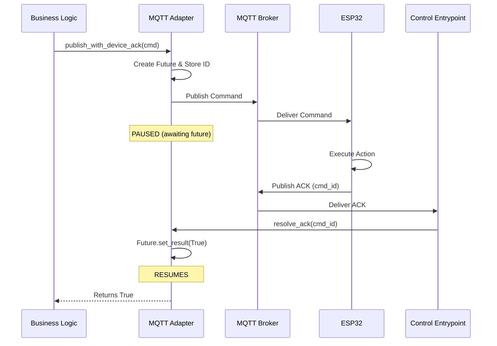

# Application-Level Acknowledgment Flow (Closed-Loop Control)

This document explains the mechanism used to ensure critical commands sent from the backend are successfully received and processed by edge devices (e.g., ESP32).

## The Problem
In standard MQTT (even with QoS 1/2), the broker confirms it received the message, but the **backend has no way of knowing if the device actually processed it**. The device could be online but the application logic could be crashed, or it could be disconnected after the broker received the message.

## The Solution: Application-Level ACKs
We implemented a request-response pattern over MQTT using `asyncio.Future` to pause execution until a specific confirmation message arrives from the device.

## The Flow

### 1. Initiating the Command
**Component:** `Handler` or Service (Business Logic)
**Action:** Calls `mqtt_adapter.publish_with_device_ack(topic, payload)`

1.  **ID Generation:** The adapter checks for a `command_id` in the payload. If missing, it generates a UUID (e.g., `cmd_123`).
2.  **Future Creation:** The adapter creates an `asyncio.Future` (a placeholder for a result) and stores it in `self._pending_responses` keyed by `cmd_123`.
3.  **Publishing:** The command is published to the broker (e.g., `greenhouse/commands/esp32_01`).
4.  **Waiting:** The code **pauses** at `await asyncio.wait_for(future)`. It effectively blocks execution of that specific task until an answer comes or it times out (default 5s).

---

### 2. Device Processing (External)
**Component:** ESP32 / Edge Device
**Action:** Receives command, acts, and replies.

1.  **Receive:** Device gets `{"command_id": "cmd_123", "action": "PUMP_ON"}`.
2.  **Execute:** Device turns on the pump.
3.  **Reply:** Device publishes a new message to `greenhouse/responses/esp32_01`:
    ```json
    {
      "header": { "type": "ack", "device_id": "esp32_01", ... },
      "payload": { "command_id": "cmd_123", "status": "success" }
    }
    ```

---

### 3. Closing the Loop
**Component:** `ControlEntrypoint` (Infrastructure Bridge)
**Action:** Receives the ACK and notifies the adapter.

1.  **Ingest:** The `ControlEntrypoint` is subscribed to `greenhouse/responses/+`. It receives the ACK message.
2.  **Extract:** It parses the JSON and finds `command_id: "cmd_123"`.
3.  **Resolve:** It calls `mqtt_adapter.resolve_ack("cmd_123")`.

---

### 4. Resuming Execution
**Component:** `MqttDriver` (Infrastructure)
**Action:** Completes the waiting Future.

1.  **Lookup:** The adapter finds the `Future` associated with `cmd_123`.
2.  **Complete:** It sets the future's result to `True`.
3.  **Resume:** The paused `publish_with_device_ack` function wakes up and returns `True`.

## Visual Diagram



