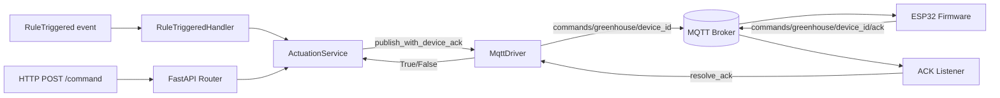

# Actuation Slice

## Purpose

The actuation slice is the command-and-control path for greenhouse devices. It publishes MQTT commands to a target ESP32, waits for a device-level acknowledgment, and surfaces that result through a FastAPI endpoint. It is also triggered automatically by the Automation slice when a `RuleTriggered` event fires.

## Files

| File | Role |
|---|---|
| `src/features/actuation/models.py` | `ActuationAction` enum + `ActuationCommand` domain command |
| `src/features/actuation/service.py` | `ActuationService` — builds MQTT payload, publishes, waits for ACK |
| `src/features/actuation/handlers.py` | `RuleTriggeredHandler` — subscribes to `RuleTriggered`, calls service |
| `src/features/actuation/listeners.py` | `register_actuation_ack_listener` — resolves pending futures on device ACK |
| `src/features/actuation/router.py` | `POST /api/v1/actuation/{device_id}/command` — manual override endpoint |

## Supported Actions

`ActuationAction` values match the firmware command strings exactly:

| Value | Effect on ESP32 |
|---|---|
| `PUMP_ON` | Turns water pump relay ON |
| `PUMP_OFF` | Turns water pump relay OFF |
| `FAN_ON` | Turns ventilation fan relay ON |
| `FAN_OFF` | Turns ventilation fan relay OFF |

## Architecture Diagram



## Runtime Flow

### Automatic path (Automation → Actuation)

1. `TelemetryAutomationHandler` evaluates a `ControlRule` threshold and publishes `RuleTriggered`.
2. `RuleTriggeredHandler.__call__(event)`:
   - validates `event.action` is a known `ActuationAction` (drops unknown actions with a log)
   - builds an `ActuationCommand` with optional `pulse_duration_ms` parameters
   - calls `ActuationService.publish_with_device_ack(command)`
3. Service builds MQTT payload, registers a pending `asyncio.Future` keyed by `command_id`.
4. MqttDriver publishes to `commands/greenhouse/{device_id}`.
5. ESP32 executes command and replies on `commands/greenhouse/{device_id}/ack`.
6. `ActuationAckListener` decodes ACK, calls `service.resolve_ack(command_id)`.
7. Future resolves → handler logs result.

### Manual path (HTTP → Actuation)

Same from step 3 onward. The router builds the `ActuationCommand` from the request body.

## MQTT Payloads

**Command (Backend → ESP32):**
```json
{
  "command_id": "8c3b77f4-4adf-4a77-8c4a-9c1b21b0f4f2",
  "device_id": "esp32-gh-01",
  "action": "PUMP_ON",
  "timestamp": "2026-06-02T10:00:00+00:00",
  "parameters": { "pulse_duration_ms": 3000 }
}
```

**ACK (ESP32 → Backend):**
```json
{ "command_id": "8c3b77f4-4adf-4a77-8c4a-9c1b21b0f4f2" }
```

## HTTP Endpoint

```
POST /api/v1/actuation/{device_id}/command
Body: { "action": "PUMP_ON", "parameters": null }

200 OK  → device ACK received within 5 s
504     → ACK timeout
```

## Error Handling

- Unknown `action` in `RuleTriggered` → logged and dropped; no command sent.
- ACK timeout (5 s) → `publish_with_device_ack` returns `False`; logged.
- JSON decode error on ACK message → logged; pending future left to time out.

## Wiring (main.py)

```python
actuation_service = ActuationService(mqtt_driver)
register_actuation_ack_listener(mqtt_driver, actuation_service)
app.state.actuation_service = actuation_service

rule_triggered_handler = RuleTriggeredHandler(actuation_service)
message_bus.subscribe(RuleTriggered, rule_triggered_handler)
```
