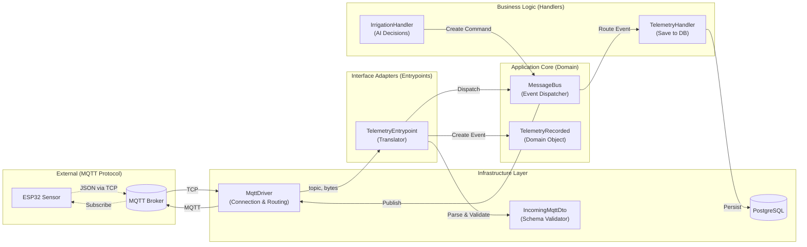
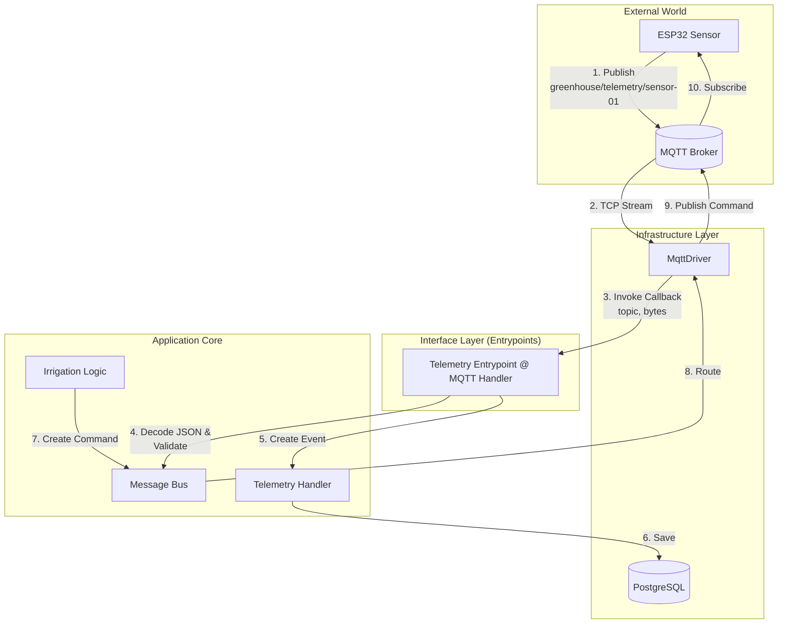
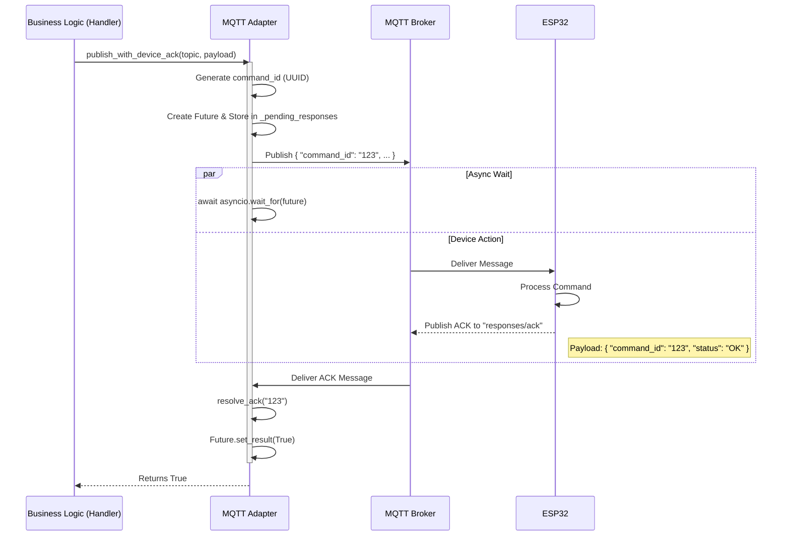

# System Architecture

## Clean Architecture Layers



## High-Level Telemetry Data Flow

This diagram illustrates how data flows from the edge devices (ESP32) through the Clean Architecture layers of the backend.



---

## Detailed Telemetry Message Processing Flow

```mermaid
sequenceDiagram
    participant Device as ESP32 Device
    participant Broker as MQTT Broker
    participant Adapter as MqttDriver
    participant Entrypoint as TelemetryEntrypoint
    participant Schema as IncomingMqttDto
    participant Bus as MessageBus
    participant Handler as TelemetryHandler
    participant DB as PostgreSQL

    Device->>Broker: 1. Publish JSON<br/>{header: {...}, payload: {...}}
    Broker->>Adapter: 2. Deliver to greenhouse/telemetry/+
    Adapter->>Adapter: 3. Match topic pattern
    Adapter->>Entrypoint: 4. Invoke on_telemetry_message(topic, bytes)
    
    activate Entrypoint
    Entrypoint->>Entrypoint: 5a. Decode bytes → UTF-8 string
    Entrypoint->>Entrypoint: 5b. Parse JSON
    Entrypoint->>Schema: 5c. Validate with IncomingMqttDto
    
    alt Validation Success
        Schema-->>Entrypoint: Valid envelope ✓
        Entrypoint->>Entrypoint: 6. Extract device_id, temperature, humidity
        Entrypoint->>Entrypoint: 7. Create TelemetryRecorded
        Entrypoint->>Bus: 8. await bus.handle(event)
        deactivate Entrypoint
        
        Bus->>Handler: 9. Route event to matching handler
        activate Handler
        Handler->>DB: 10. Insert/Update telemetry record
        DB-->>Handler: ✓ Persisted
        deactivate Handler
    else Validation Failure
        Schema-->>Entrypoint: ValidationError ✗
        Entrypoint->>Entrypoint: Log error (data not entered system)
        deactivate Entrypoint
    end
```

## Command with Acknowledgment Flow

This sequence shows the specific flow for the `publish_with_device_ack` feature, where the backend waits for the device to confirm receipt.



---

## Data Validation Boundary

The **Entrypoint Layer** is the critical boundary where untrusted external data is validated before entering the system:

```
UNTRUSTED DATA ZONE          │  TRUSTED DOMAIN ZONE
(Raw MQTT bytes)             │  (Domain Events only)
                             │
Adapter receives bytes ──→   │
                      ↓      │
                   Entrypoint processes:
                      • JSON decode ──→ Catch JSONDecodeError
                      • Schema validation ──→ Catch ValidationError
                      • Type checking
                      • Required fields check
                             ↓      │
                   Event created    │
                             ↓      │
Message Bus (only events) ←──────────
```

**Critical Rule**: If validation fails at the Entrypoint, the error is logged and the message is **dropped**. No corrupted data reaches handlers.

---

## Component Roles

### 1. MQTT Adapter (`infrastructure/mqtt_driver.py`)
- **Role**: The physical gateway.
- **Responsibility**: 
  - Maintains TCP connection to broker.
  - Routes raw MQTT messages to registered callbacks using topic pattern matching.
  - Manages the ACK wait loop (`publish_with_device_ack`).
- **Dependencies**: `aiomqtt`.
- **Key Pattern**: Callback registry with decorator-based registration.

### 2. Entrypoints (`features/*/entrypoints.py`)
- **Role**: The translation & validation layer.
- **Responsibility**: 
  - Converts `(topic, bytes)` → `DomainEvent`.
  - **Validates all data against schemas** (Pydantic IncomingMqttDto).
  - Extracts business-relevant fields.
  - Stops bad data from entering the core.
- **Example** (`TelemetryEntrypoint`):
  1. Decode bytes → JSON
  2. Validate against `IncomingMqttDto`
  3. Extract `temperature`, `humidity`, `device_id`
  4. Create `TelemetryRecorded`
  5. Dispatch to MessageBus

### 3. Message Bus (`infrastructure/message_bus.py`)
- **Role**: The central nervous system.
- **Responsibility**: 
  - Decouples the "trigger" (Entrypoint) from the "action" (Handler).
  - Routes `DomainEvent` to all registered handlers.
  - Allows one event to trigger multiple handlers (publish-subscribe).

### 4. Handlers (`features/*/handlers.py`)
- **Role**: The brain.
- **Responsibility**: 
  - Pure business logic.
  - Database persistence.
  - Decision-making ("If humidity < 30%, start irrigation").
  - Calling `publish_with_device_ack` to send commands back.
- **Assumption**: Only receives valid domain events (validation already done at Entrypoint).

---

## Message Format: IncomingMqttDto

All MQTT messages must follow this structure (defined in `infrastructure/schemas.py`):

```json
{
  "header": {
    "type": "telemetry",           // or "command", "ack", etc.
    "device_id": "sensor-01",
    "timestamp": "2026-03-22T10:30:00Z"
  },
  "payload": {
    "temperature": 25.5,
    "humidity": 60.0,
    // ... any additional fields
  }
}
```

**Validation Occurs Here**:
- Header is mandatory and must match Pydantic schema.
- Payload is flexible (dict), but handlers may perform additional field checks.
- Timestamp format must be ISO 8601.
- Device ID must be a non-empty string.


