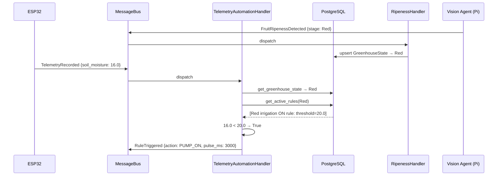

# Automation Slice

## Purpose

The automation slice is the data-driven rules engine. It monitors incoming telemetry events, queries the database for active `ControlRule` rows matching the current plant stage, evaluates each rule's threshold against the live sensor value, and fires a `RuleTriggered` event when a threshold is crossed. It also listens for `FruitRipenessDetected` events from the Vision slice and updates the current `GreenhouseState` in the database, which changes which rules are active.

**No logic is hardcoded.** All thresholds, operators, actions, and stage scoping live in the database and can be changed at runtime via the REST API.

## Files

| File | Role |
|---|---|
| `src/features/automation/models.py` | SQLModel DB tables: `ControlRule`, `GreenhouseState`, `WateringPolicy`, `WateringTimes` + `PlantStage` enum |
| `src/features/automation/events.py` | `RuleTriggered` domain event |
| `src/features/automation/repository.py` | `AutomationRepository` — DB queries for state and rules |
| `src/features/automation/handlers.py` | `TelemetryAutomationHandler` + `RipenessHandler` |
| `src/features/automation/router.py` | REST endpoints for managing rules, policies, and reading state |

## Database Models

### `PlantStage` enum

| Value | Meaning |
|---|---|
| `Green` | Vegetative / pre-fruiting stage |
| `WhitePink` | Flowering / early fruiting transition |
| `Red` | Ripening / harvest-ready |

### `GreenhouseState`

Tracks the current plant stage for each device. Updated every time the Vision slice reports a new inference result.

| Column | Type | Description |
|---|---|---|
| `id` | UUID PK | — |
| `device_id` | str | Identifies the greenhouse/camera |
| `plant_stage` | PlantStage | Current dominant stage |
| `updated_at` | datetime | Last update timestamp |

### `ControlRule`

One row = one threshold rule evaluated against incoming telemetry.

| Column | Type | Description |
|---|---|---|
| `id` | UUID PK | — |
| `name` | str | Human-readable label |
| `plant_stage` | PlantStage nullable | Stage this rule applies to; NULL = all stages |
| `sensor_metric` | str | Telemetry field name: `temperature`, `humidity`, `soil_moisture`, `water_level` |
| `operator` | str | `lt`, `lte`, `gt`, `gte` |
| `threshold` | float | Comparison value |
| `action` | str | `ActuationAction` value: `PUMP_ON`, `PUMP_OFF`, `FAN_ON`, `FAN_OFF` |
| `device_id` | str | Target ESP32 device ID |
| `pulse_duration_ms` | int | Passed to firmware as parameter; 0 = no limit |
| `is_active` | bool | Soft enable/disable |

### `WateringPolicy`

Per-stage operational targets (informational — used for dashboards and future advanced control).

| Column | Type | Description |
|---|---|---|
| `plant_stage` | PlantStage UNIQUE | One row per stage |
| `target_moisture` | float | Target soil moisture % |
| `max_temperature` | float | Fan trigger ceiling for this stage |
| `is_active` | bool | — |

### `WateringTimes`

Per-stage irrigation schedule parameters (for future scheduler integration).

| Column | Type | Description |
|---|---|---|
| `plant_stage` | PlantStage | — |
| `watering_duration_ms` | int | How long to run the pump |
| `rest_period_sec` | int | Minimum rest between irrigation cycles |

## Handlers

### `TelemetryAutomationHandler`

Triggered by every `TelemetryRecorded` event (every 30 minutes from ESP32).

```
1. Open DB session
2. get_greenhouse_state(device_id)   → current PlantStage (default: Green)
3. get_active_rules(stage)           → ControlRule rows WHERE
                                       is_active = TRUE AND
                                       (plant_stage = stage OR plant_stage IS NULL)
4. For each rule:
     value = getattr(event, rule.sensor_metric)   # e.g. event.soil_moisture
     if operator(value, threshold):               # e.g. 16.0 < 20.0
         bus.handle(RuleTriggered(...))
```

### `RipenessHandler`

Triggered by every `FruitRipenessDetected` event (every 4 hours from Pi camera).

```
1. Open DB session
2. upsert_greenhouse_state(device_id, event.stage)
3. Log stage change
```

## Events

### `RuleTriggered`

```python
class RuleTriggered(BaseModel):
    rule_id:           UUID
    device_id:         str
    action:            str   # ActuationAction value
    pulse_duration_ms: int
```

Consumed by `RuleTriggeredHandler` in the Actuation slice.

## Architecture Diagram



## Albion Strawberry Seed Data

Pre-seeded rules and policies for the Albion variety are in `Backend/seeds/seed_albion.py`.

Run once after the database is initialized:
```bash
python Backend/seeds/seed_albion.py
```

| Stage | Soil ON threshold | Fan ON (temp) | Fan ON (humidity) | Pump pulse |
|---|---|---|---|---|
| Green | < 30 % | > 24 °C | > 75 % | 5 000 ms |
| WhitePink | < 28 % | > 21 °C | > 60 % | 5 000 ms |
| Red | < 20 % (stress) | > 27 °C | > 70 % | 3 000 ms |
| Global | — | > 32 °C (emergency) | — | — |

Each ON rule has a complementary OFF rule with a hysteresis band (e.g. pump OFF when soil > 35 %).

## REST API

| Method | Path | Description |
|---|---|---|
| `GET` | `/api/v1/automation/state` | Current `GreenhouseState` for all devices |
| `GET` | `/api/v1/automation/rules` | List all `ControlRule` rows |
| `POST` | `/api/v1/automation/rules` | Create a new rule |
| `PATCH` | `/api/v1/automation/rules/{id}` | Update rule (toggle `is_active`, change threshold) |
| `DELETE` | `/api/v1/automation/rules/{id}` | Remove a rule |
| `GET` | `/api/v1/automation/policies` | List `WateringPolicy` rows |
| `POST` | `/api/v1/automation/policies` | Upsert policy for a stage |

## Wiring (main.py)

```python
ripeness_handler = RipenessHandler(async_session_maker, message_bus)
message_bus.subscribe(FruitRipenessDetected, ripeness_handler)

telemetry_automation_handler = TelemetryAutomationHandler(async_session_maker, message_bus)
message_bus.subscribe(TelemetryRecorded, telemetry_automation_handler)
```
