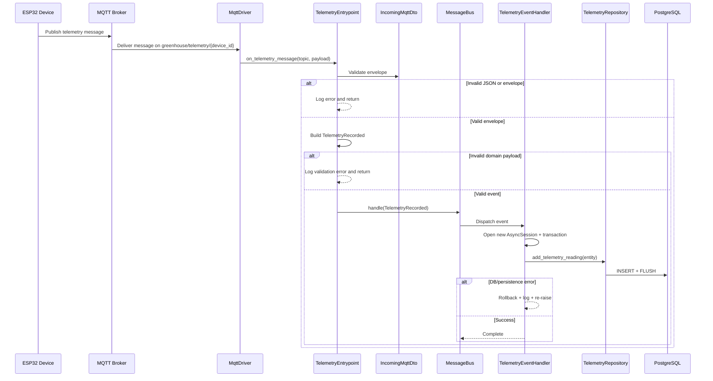

# Telemetry Feature

This document describes the telemetry vertical slice and how data moves from MQTT into PostgreSQL.

## Purpose

The telemetry feature ingests sensor data from ESP32 devices, validates the message contract, dispatches a domain event through the message bus, and persists readings with an isolated transaction per inbound message.

## Components

- `src/features/telemetry/entrypoints.py`
  - `TelemetryEntrypoint` translates raw MQTT messages into domain events.
  - `register_telemetry_entrypoint(...)` wires the entrypoint to topic `greenhouse/telemetry/+`.
- `src/features/telemetry/events.py`
  - `TelemetryRecorded` is the immutable domain event for valid telemetry.
- `src/features/telemetry/handlers.py`
  - `TelemetryEventHandler` is the application handler that opens one DB session/transaction per event.
- `src/features/telemetry/repository.py`
  - `TelemetryRepository` persists entities using `add + flush` only (no commit/rollback).
- `src/features/telemetry/models.py`
  - `TelemetryReading` is the persistence model stored in PostgreSQL.

## Architecture Diagram

```mermaid
flowchart LR
    ESP32[ESP32 Device]
    Broker[MQTT Broker]
    Driver[MqttDriver]
    Entrypoint[TelemetryEntrypoint]
    Envelope[IncomingMqttDto Validation]
    Event[TelemetryRecorded Event]
    Bus[MessageBus]
    Handler[TelemetryEventHandler]
    Repo[TelemetryRepository]
    DB[(PostgreSQL)]

    ESP32 -->|publish telemetry JSON| Broker
    Broker -->|greenhouse/telemetry/+| Driver
    Driver --> Entrypoint
    Entrypoint --> Envelope
    Envelope --> Event
    Event --> Bus
    Bus --> Handler
    Handler --> Repo
    Repo --> DB
```



## Message Contract

Incoming payload is validated as infrastructure DTO first:

- Envelope: `IncomingMqttDto`
- Header fields used by telemetry flow:
  - `type` (must be `"telemetry"`)
  - `device_id`
  - `timestamp`
- Payload fields expected by telemetry event:
  - `temperature` (required)
  - `humidity` (required)
  - `soil_moisture` (optional — 0.0–100.0 %)
  - `water_level` (optional — 0 = full, 1 = empty)

Example valid message:

```json
{
  "header": {
    "type": "telemetry",
    "device_id": "esp32-gh-01",
    "timestamp": "2026-06-02T10:00:00+00:00"
  },
  "payload": {
    "temperature": 22.5,
    "humidity": 65.0,
    "soil_moisture": 24.3,
    "water_level": 0
  }
}
```

## Runtime Flow

1. MQTT driver receives a message on `greenhouse/telemetry/{device_id}`.
2. `TelemetryEntrypoint.on_telemetry_message(topic, payload)`:
   - decodes bytes and parses JSON,
   - validates envelope using `IncomingMqttDto`,
   - rejects non-telemetry message types,
   - injects `device_id` and `timestamp` from header into payload,
   - builds `TelemetryRecorded` (Pydantic validation),
   - dispatches event via `MessageBus.handle(event)`.
3. `MessageBus` routes `TelemetryRecorded` to subscribed handlers.
4. `TelemetryEventHandler.__call__(event)`:
   - creates a fresh `AsyncSession` for this event,
   - starts `async with session.begin()` transaction boundary,
   - maps event to `TelemetryReading`,
   - calls `TelemetryRepository.add_telemetry_reading(...)`.
5. Repository stages and flushes changes; transaction commit/rollback is managed by handler scope.

## Runtime Flow Diagram



## Validation Rules

`TelemetryRecorded` currently enforces:

- `temperature` range: `-40.0` to `85.0`
- `humidity` range: `0.0` to `100.0`
- `device_id`: non-empty string
- `timestamp`: required datetime (device-reported timestamp)
- `soil_moisture`: optional float, `0.0`–`100.0` % (used by Automation rules engine)
- `water_level`: optional int, `0` (full) or `1` (empty)

Model config:

- immutable (`frozen=True`)
- no extra fields (`extra="forbid"`)

## Transaction and Session Policy

Telemetry persistence follows per-message unit-of-work semantics:

- one new session per inbound telemetry event,
- one transaction per event (`session.begin()`),
- defensive rollback on failure,
- session automatically closed by context manager,
- repository does not own transaction boundaries.

This prevents cross-message transaction coupling and keeps error handling explicit.

## Error Handling

In `TelemetryEntrypoint`:

- invalid JSON -> logs decode error and returns,
- invalid envelope -> logs schema validation error and returns,
- invalid telemetry payload -> logs event validation error and returns.

In `TelemetryEventHandler`:

- any DB/persistence exception -> rollback if transaction is active,
- logs stack trace,
- re-raises so upstream systems can apply retries/alerts.

## Wiring Notes

For ingestion to work end-to-end, both registrations must exist at startup:

1. entrypoint registration (`register_telemetry_entrypoint(...)`),
2. bus subscription mapping `TelemetryRecorded -> TelemetryEventHandler`.

If logs show `No handler found for: TelemetryRecorded`, the bus subscription is missing or mismatched.

## Testing Pyramid (Current Intent)

- Unit tests: handler success and failure behavior with fakes (transaction/rollback semantics).
- Integration tests: real PostgreSQL + real repository + real handler.
- E2E tests: MQTT publish into broker and assert DB insert.

Detailed test docs:

- `docs/telemetry_tests_overview.md`
- `docs/telemetry_unit_tests.md`
- `docs/telemetry_integration_tests.md`
- `docs/telemetry_e2e_tests.md`

Keep telemetry tests aligned with this feature contract and transaction policy.
