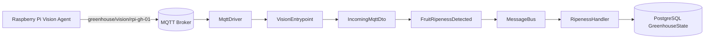

# Vision Slice

## Purpose

The vision slice is the backend receiver for Raspberry Pi inference results. It subscribes to the MQTT topic `greenhouse/vision/+`, validates and parses the JSON envelope, constructs a `FruitRipenessDetected` domain event, and dispatches it to the `MessageBus`. The Automation slice's `RipenessHandler` then consumes this event to update the current plant stage in the database.

The vision slice is a **pure observer** — it never touches any actuator or writes to any table directly.

## Files

| File | Role |
|---|---|
| `src/features/vision/events.py` | `FruitRipenessDetected` domain event |
| `src/features/vision/entrypoints.py` | `VisionEntrypoint` + `register_vision_entrypoint` |

## Domain Event

```python
class FruitRipenessDetected(BaseModel):
    device_id:      str
    timestamp:      datetime
    stage:          PlantStage        # dominant detected stage
    green_pct:      float             # 0–100
    white_pink_pct: float             # 0–100
    red_pct:        float             # 0–100
    confidence:     float             # 0–1, average detection confidence
```

`PlantStage` is imported from `features.automation.models`:

| Value | Meaning |
|---|---|
| `Green` | Vegetative / pre-fruiting |
| `WhitePink` | Flowering / early fruiting |
| `Red` | Ripening / harvest-ready |

## MQTT Contract

**Topic:** `greenhouse/vision/<device_id>`

**Payload** (standard `IncomingMqttDto` envelope):

```json
{
  "header": {
    "type": "vision",
    "device_id": "rpi-gh-01",
    "timestamp": "2026-06-02T10:00:00+00:00"
  },
  "payload": {
    "stage": "Red",
    "green_pct": 10.5,
    "white_pink_pct": 0.0,
    "red_pct": 89.5,
    "confidence": 0.87
  }
}
```

## Architecture Diagram



## Runtime Flow

1. Pi Vision Agent captures image, runs Strawberry Detect inference, publishes result to `greenhouse/vision/rpi-gh-01`.
2. `MqttDriver` matches topic pattern `greenhouse/vision/+` and calls `VisionEntrypoint.on_vision_message(topic, payload)`.
3. Entrypoint:
   - decodes bytes → JSON
   - validates envelope with `IncomingMqttDto`
   - rejects messages where `header.type != "vision"`
   - injects `device_id` and `timestamp` from header
   - builds `FruitRipenessDetected` (Pydantic validation)
   - calls `bus.handle(event)`
4. `MessageBus` fans out to all subscribers of `FruitRipenessDetected`.
5. `RipenessHandler` (Automation slice) updates `GreenhouseState` in the DB.

## Error Handling

- JSON decode error → logged, message dropped.
- `IncomingMqttDto` validation failure → logged, message dropped.
- Wrong message type (`header.type != "vision"`) → logged warning, message dropped.
- `FruitRipenessDetected` validation failure → logged, message dropped.

## Wiring (main.py)

```python
from features.vision.entrypoints import register_vision_entrypoint
register_vision_entrypoint(mqtt_driver, message_bus)
```

No handler is registered in the vision slice itself — `FruitRipenessDetected` subscribers live in the Automation slice.
